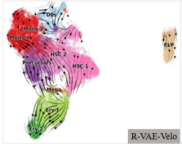

# RNA velocity

The vector that measures the trend of all genes in a cell is called RNA velocity, which is used to characterize developmental direction of the cell. 

This work proposes a deep learning model, R-VAE-Velo, integrating current neural networks and variational autoencoder. It takes the spliced and unspliced expression values obtained from sequencing as input, trains the encoder to calculate the kinetic parameters as hidden variables to calculate the velocity value, and optimizes the model parameters by determining whether the phase portrait established from the hidden variables by the decoder is sufficiently close to the true expression scatter.

By comparing the fitting ability of phase portrait decoded from networks with different structures and parameters to scatter points, the R-VAE-Velo model determines the most suitable hyperparametric values, data processing methods, and network architecture. Experiments were conducted on three real datasets to verify that the velocity value inferenced by R-VAE-Velo model is consistent with the trajectory of prior knowledge. The analysis of a particular cell type or gene can explain the true developmental direction and discipline.

### Data preparation

Input data, spliced (s) and unspliced (u) expression matrix, is preprocessed by the pipeline which is same to scVelo, that is, normalized based on second-order momentum with smoothed expression neighborhood graph. And there is also a scaling step aiming at dealing with extreme imbalance between u/s.

Considering that u/s signals can be regarded as a phase of values evolving over the course of cell development, the input data is organized as a sequence of length \(N_{\text{cell}}\), where each element is a 2-dimensional array. In this framework, genes function as multiple channels through which inner biological information is transmitted through the network.

### Latent layer variables

In the latent layer of the VAE, there are five variables, consisting of five mean values and five variances. Among these, three of the latent variables represent dynamical parameters before transformed to non-negative: the generation, splicing, and degradation velocities of mRNA, denoted as \(\alpha\), \(\beta\), and \(\gamma\) respectively. The remaining two variables serve as extremum for distinguishing between upregulation and downregulation processes. These latter two variables transform the overall network into a semi-supervised learning task, as their labels can be inferred from the expression data.

### Network archetecture

$$ \frac{du}{dt} = \alpha(t)-\beta u(t) $$
$$ \frac{ds}{dt} = \beta u(t) - \gamma s(t) $$

The overall architecture of the model is based on a VAE framework. The encoder is designed with a bidirectional LSTM or an attention block, followed by a linear layer. In contrast to standard VAE, the decoder does not employ a neural network structure. This decision stems from the challenge of reconstructing the original data from a 10-dimensional latent variable. Instead, the model utilizes the analytical solution of above differential equations to compute the theoretical expression phase curve through dynamical parameters. When dealing with datasets of high information density, the computation can be performed in batches according to channels, i.e., genes, to manage the computational load effectively.

### Loss function

For a typical VAE, loss function comprises two main components: the reconstruction loss and the distribution loss. In this specific model, the reconstruction loss is derived from MSE between the sampling points of theoretical phase curve and the observed expression values. The distribution loss adheres to the conventional formulation. Additionally, this model incorporates an extra supervision loss term, which quantifies the discrepancy between the momentum in latent variable and its corresponding label. This inclusion aims to guide the learned latent space distribution towards a form similar to that of a Conditional VAE, thereby direct the model to converge with less stochasticity or blindness.

### Velocity generation

Finally, velocity matrix is calculated with latent variables.

$$ **v** = \beta u - \gamma s $$

## Overall model archetecture

## Some results

fitted scatter from Dentate Gyrus dataset

Generated velocity field in Bone Marrow dataset

Generated velocity field in Fore Brain dataset, together with pseudotime from Monocle

Use velocity to improve reduced-dimentional visualization

